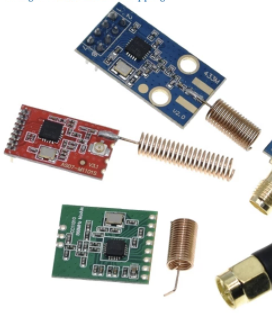

# CC1101 support for ESPHome

IMPORTANT: make sure to copy both `cc1101.yaml` and `cc1101.h`

# Basic
see cc1101.yaml

# Advanced
See cc1101-advanced.yaml
Adds RSSI sensor and number components to tweak frequency and bandwidth on the fly.
I use this to tweak the values to maximize reception.

