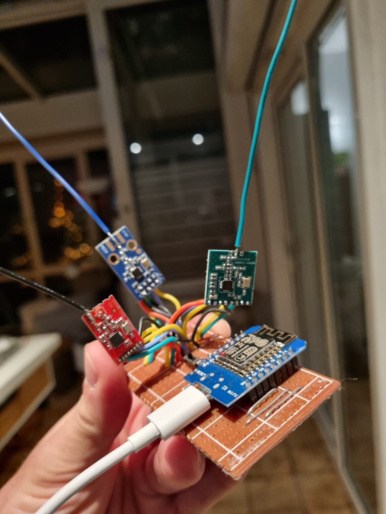

# IMPORTANT
--> make sure to copy both `cc1101.yaml` and `cc1101.h` <--

# CC1101 support for ESPHome

# Basic Usage
see cc1101.yaml

# Advanced
See cc1101-advanced.yaml

Adds RSSI sensor and number components to tweak frequency and bandwidth on the fly.
I use this to tweak the values to maximize reception.

# Links:

* Discord thread: https://discord.com/channels/429907082951524364/838121145113772033/959545959484911666
* Github support request issue: https://github.com/esphome/feature-requests/issues/59